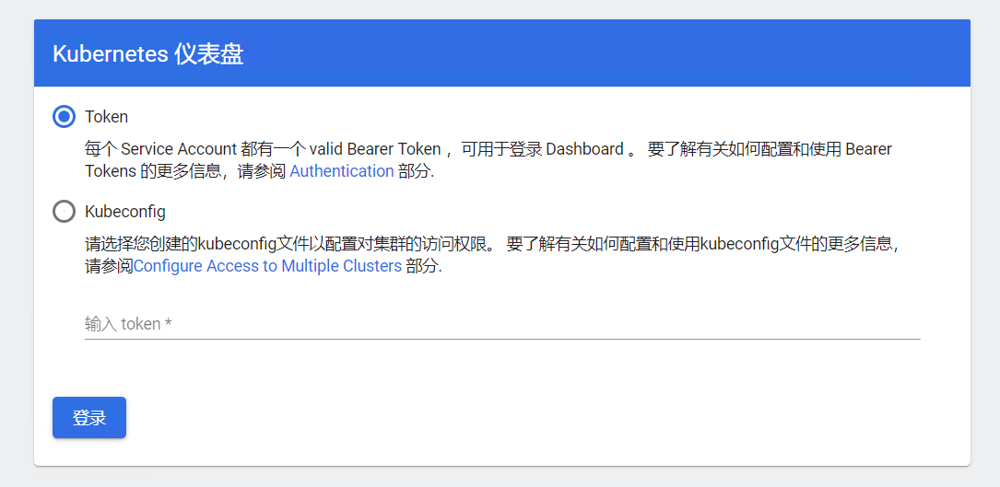

# dashboard使用说明

登陆dashboard的几种主要方式

- kubectl proxy

  只能运行该命令的主机上访问dashboard

- kubectl port-fortward

- NodePort

  可以通过端口访问，从外部访问可能需要输入serviceaccount的token，同时地址前缀需要加上https

  比如：[https://172.16.2.100:31442](https://172.16.2.100:31442/) 如果是[http://172.16.2.100:31442](http://172.16.2.100:31442/)则完全不能看到任何响应。

## NodePort方式登录dashboard的注意点

## Login not available

If your login view displays below error, this means that you are trying to log in over HTTP and it has been disabled for the security reasons.

Logging in is available only if URL used to access Dashboard starts with:

- `http://localhost/...`
- `http://127.0.0.1/...`
- `https://<domain_name>/...`

从外部访问的可能界面：



### 获取token的办法

```sh
# All secrets with type 'kubernetes.io/service-account-token' will allow to log in.
# 需要注意不同的账户的权限是不同的
kubectl -n kube-system get secret
# 经过实验发现kube-proxy-token-*的权限最大，可以正常显示几乎所有的资源
kubectl -n kube-system describe secret kube-proxy-token-fcs2b
Name:         kube-proxy-token-fcs2b
Namespace:    kube-system
Labels:       <none>
Annotations:  kubernetes.io/service-account.name: kube-proxy
              kubernetes.io/service-account.uid: cbedb30a-6729-43e8-9504-5aa4b769194e

Type:  kubernetes.io/service-account-token

Data
====
ca.crt:     1025 bytes
namespace:  11 bytes
token:      eyJhbGciOiJSUzI1NiIsImtpZCI6IkxsMzZwYVAwZnBtdzVvVjIxRDVOQ1FpN2ttdm9PQXk1ZkFJNXQ3NWRQMlUifQ.eyJpc3MiOiJrdWJlcm5ldGVzL3NlcnZpY2VhY2NvdW50Iiwia3ViZXJuZXRlcy5pby9zZXJ2aWNlYWNjb3VudC9uYW1lc3BhY2UiOiJrdWJlLXN5c3RlbSIsImt1Ym......
```

## 可以参考这篇博客创建集群管理员sa和token

https://www.cnblogs.com/rainingnight/p/deploying-k8s-dashboard-ui.html